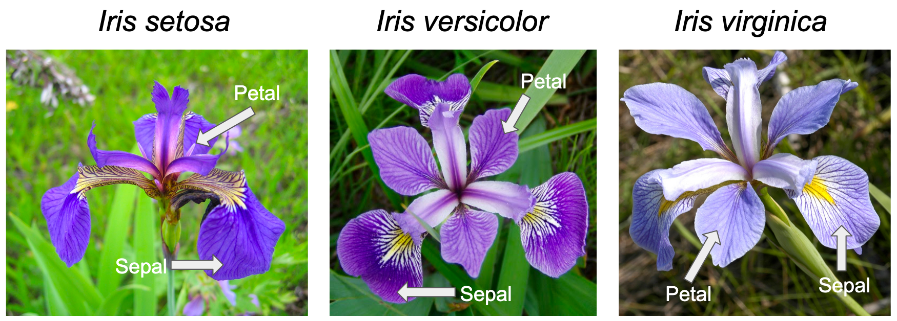

# Iris Dataset Analysis

## About the Iris Dataset   
The Iris dataset, also know as Fischer's Iris dataset, is a collection of data about three species of the Iris flower. The data was published by Ronald Fisher in a 1936 paper.  

The three species of the flower are:   
- Iris setosa
- Iris virginica
- Iris versicolor   

Fifty samples from each of the species were examined using the following four measures:   
- Sepal Length
- Sepal Width
- Petal Length
- Petal Width

Below is a picture of the three species 
Image sourced from [Kaggle](https://www.kaggle.com/code/sunaysawant/iris-eda)

More information about the dataset can be found on [Wikepedia](https://en.wikipedia.org/wiki/Iris_flower_data_set)

## About the Analysis
